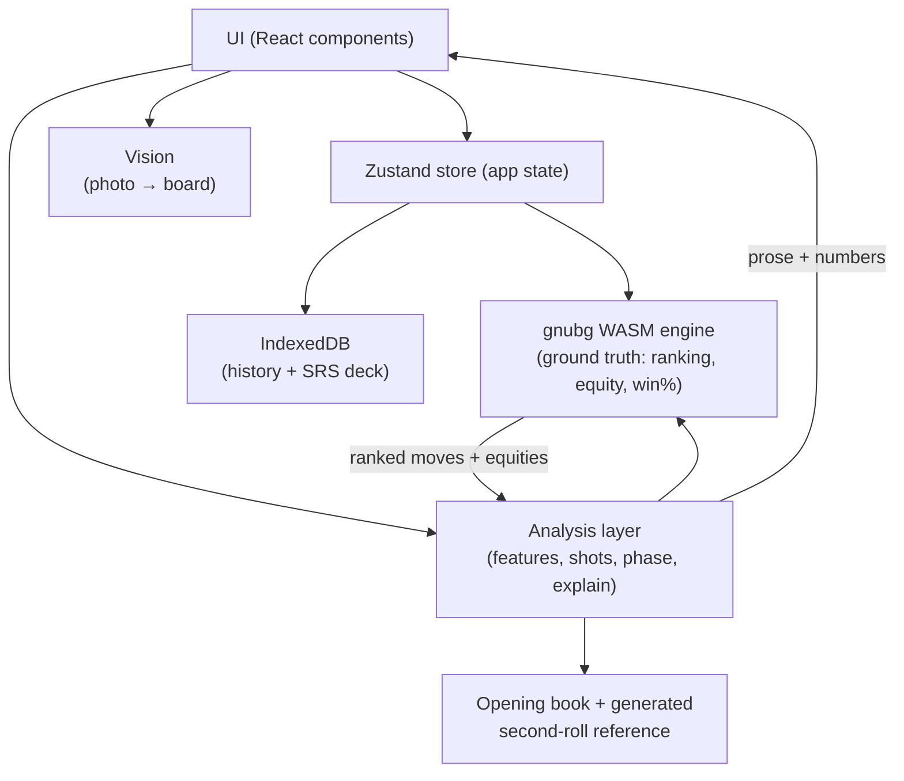
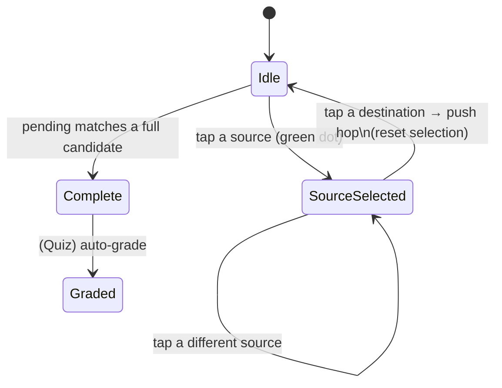
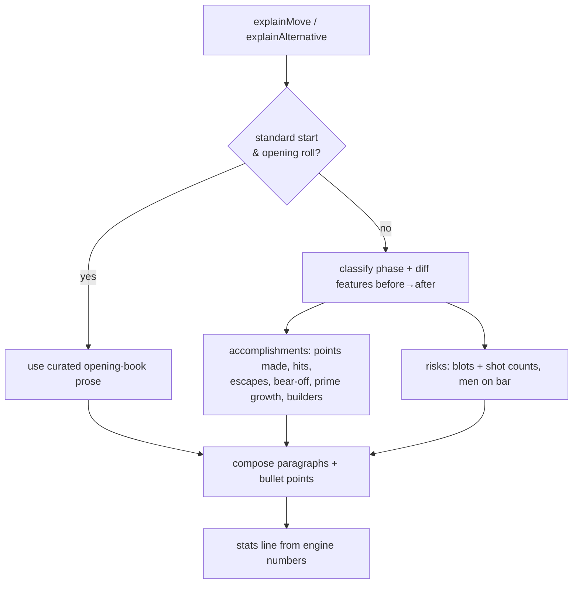
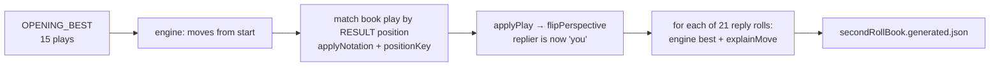
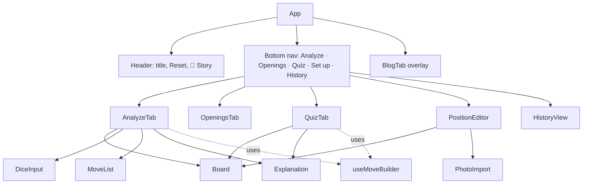

# Pocket Backgammon Teacher — Maintainer's Guide

This document is the deep-dive technical reference for anyone maintaining or
extending this codebase. It explains *why* things are shaped the way they are,
not just *what* they do. Read [§1](#1-system-overview) and
[§4](#4-the-board-model--coordinate-system) first — almost every bug in this app
comes from getting the board coordinate model wrong.

> **Status note.** The app shipped incrementally as independent feature PRs.
> This guide documents the **full intended system** (all features merged). If
> you check out a branch that is missing a feature, some files referenced here
> won't exist yet. See [§3.1](#31-which-pr-introduces-what) for the map.

---

## Table of contents

1. [System overview](#1-system-overview)
2. [Tech stack & external dependencies](#2-tech-stack--external-dependencies)
3. [Repository layout](#3-repository-layout)
4. [The board model & coordinate system](#4-the-board-model--coordinate-system) ← **read this**
5. [The engine (gnubg via WebAssembly)](#5-the-engine-gnubg-via-webassembly)
6. [Move handling & tap-to-build](#6-move-handling--tap-to-build)
7. [The analysis & explanation engine](#7-the-analysis--explanation-engine)
8. [The opening book & second-roll generation](#8-the-opening-book--second-roll-generation)
9. [State, persistence & spaced repetition](#9-state-persistence--spaced-repetition)
10. [UI layer](#10-ui-layer)
11. [Photo → board (offline computer vision)](#11-photo--board-offline-computer-vision)
12. [PWA & offline](#12-pwa--offline)
13. [Build, test, run & deploy](#13-build-test-run--deploy)
14. [Common maintenance tasks](#14-common-maintenance-tasks)
15. [Known issues, gotchas & footguns](#15-known-issues-gotchas--footguns)
16. [Glossary of backgammon terms](#16-glossary-of-backgammon-terms)
17. [External references](#17-external-references)

---

## 1. System overview

A **fully client-side, offline-capable Progressive Web App** that coaches a
human on backgammon. You set up a position, enter a dice roll, and it explains
the best move in plain English, lets you compare alternatives, quizzes you with
spaced repetition, and keeps a local history. There is **no backend** and **no
API key** anywhere.

### The one idea that makes it work

> The hard problem — *which move is best?* — is delegated entirely to a
> world-class neural-net engine (gnubg). The app's own logic **never decides**
> what is best; it only **describes** decisions the engine has already made,
> grounded in the engine's exact numbers.

This separation is the architectural keystone. Hand-writing backgammon strategy
rules would be hopeless; *describing the difference* between two positions the
engine has already scored is tractable. Everywhere you see "explanation," read
it as "translation of engine numbers into English," never "independent
judgement."



### Design principles

- **Engine is the source of truth.** Best move, equity cost of any alternative,
  win/gammon/backgammon probabilities — all from gnubg.
- **Explanations are generated from the numbers**, so prose and math can never
  disagree.
- **Offline & private.** Engine, analysis, and storage all run in the browser;
  the service worker caches the (large) engine for offline use.
- **Mobile-first.** Single column, big tap targets, bottom tab bar, SVG board.

---

## 2. Tech stack & external dependencies

| Concern | Choice | Notes / docs |
|---|---|---|
| Build tool | [Vite 5](https://vitejs.dev/) | dev server, bundler, `?raw` & `import.meta.glob` imports |
| UI | [React 18](https://react.dev/) + TypeScript | function components + hooks only |
| Styling | [Tailwind CSS 3](https://tailwindcss.com/docs) | utility classes; theme in `tailwind.config.js` |
| State | [Zustand 4](https://github.com/pmndrs/zustand) | one small global store |
| Persistence | [idb](https://github.com/jakearchibald/idb) over [IndexedDB](https://developer.mozilla.org/en-US/docs/Web/API/IndexedDB_API) | history + spaced-repetition deck |
| PWA / offline | [vite-plugin-pwa](https://vite-pwa-org.netlify.app/) (Workbox) | precaches the engine wasm |
| Tests | [Vitest](https://vitest.dev/) | pure-logic unit tests (no DOM) |
| Engine | [GNU Backgammon](https://www.gnu.org/software/gnubg/) via [foochu/bgweb-api](https://github.com/foochu/bgweb-api) compiled to [WebAssembly](https://developer.mozilla.org/en-US/docs/WebAssembly) | neural-net evaluator |
| Build script runtime | [tsx](https://github.com/privatenumber/tsx) (dev only) | runs the TS book generator in Node |
| Deploy | Docker → [nginx](https://nginx.org/en/docs/) | static hosting |

There are **no runtime npm dependencies beyond React/Zustand/idb**. The vision
and markdown features use only the standard Web Canvas API and hand-written
parsing.

---

## 3. Repository layout

```
.
├── Dockerfile, nginx.conf, docker-compose.yml, .dockerignore   # deploy (PR: docker)
├── index.html                  # Vite entry; sets viewport/theme/PWA meta
├── vite.config.ts              # Vite + React + PWA (workbox) config
├── tailwind.config.js, postcss.config.js
├── tsconfig.json
├── public/
│   ├── engine/
│   │   ├── gnubg.wasm           # ~18 MB: gnubg nets compiled to wasm
│   │   └── wasm_exec.js         # Go's wasm runtime glue (verbatim from Go)
│   └── icons/icon.svg
├── scripts/                     # (PR: opening-second-roll)
│   ├── engineNode.ts            # Node driver for the wasm engine
│   └── genSecondRoll.ts         # generates the second-roll book JSON
├── src/
│   ├── main.tsx                 # React root
│   ├── index.css                # Tailwind layers + base styles
│   ├── engine/
│   │   ├── board.ts             # Board model + all coordinate conversions
│   │   ├── gnubg.ts             # browser wasm loader + getMoves()
│   │   └── moves.ts             # notation, position-matching, legal next hops
│   ├── analysis/
│   │   ├── shots.ts             # shot (hit) counting
│   │   ├── features.ts          # positional feature extraction
│   │   ├── phase.ts             # game-phase classifier
│   │   ├── presets.ts           # teaching positions for the editor
│   │   ├── openingBook.ts       # curated 15 openings + second-roll lookups
│   │   ├── secondRollBook.ts            # wraps the generated JSON (PR: openings)
│   │   ├── secondRollBook.generated.json # ~315 replies (PR: openings)
│   │   └── explain.ts           # THE explanation generator
│   ├── state/
│   │   ├── store.ts             # Zustand store
│   │   ├── history.ts           # IndexedDB: history + SRS deck (v2)
│   │   └── srs.ts               # SM-2 scheduler (PR: quiz)
│   ├── vision/
│   │   └── boardScan.ts         # photo → Board (PR: photo)
│   ├── content/blog/*.md        # blog posts (PR: blog)
│   └── ui/
│       ├── App.tsx              # layout, tabs, header, Story overlay
│       ├── Board.tsx            # SVG board renderer + tap targets
│       ├── DiceInput.tsx
│       ├── MoveList.tsx, Explanation.tsx
│       ├── AnalyzeTab.tsx       # main analyze flow
│       ├── useMoveBuilder.ts    # shared tap-to-build hook (PR: quiz)
│       ├── OpeningsTab.tsx      # second-roll study screen (PR: openings)
│       ├── QuizTab.tsx          # spaced-repetition quiz (PR: quiz)
│       ├── PositionEditor.tsx   # manual board editor + presets
│       ├── PhotoImport.tsx      # photo calibration UI (PR: photo)
│       ├── HistoryView.tsx
│       ├── BlogTab.tsx, markdown.ts   # in-app blog reader (PR: blog)
│       └── RichText.tsx         # renders **bold**/`code` spans in explanations
└── test/core.test.ts            # Vitest suite
```

### 3.1 Which PR introduces what

| Feature branch | Adds |
|---|---|
| (base, merged) | engine, board, moves, analysis core, explain, Analyze/Edit/History tabs, history v1 |
| `feat/move-preview` | board previews the focused move in Analyze |
| `feat/docker-deploy` | `Dockerfile`, `nginx.conf`, compose, deploy docs |
| `feat/opening-second-roll` | `scripts/`, `secondRollBook*`, `OpeningsTab`, `applyNotation`, `lookupSecondRoll`, 3-2 book entry |
| `feat/flashcards-quiz` | `srs.ts`, history **v2** + SRS store, `useMoveBuilder`, `QuizTab`, due badge; **fixes** phantom-source / dest-precedence bugs in `moves.ts` + the builder |
| `feat/photo-import` | `vision/boardScan.ts`, `PhotoImport.tsx`, `data-point` attrs on `Board` |
| `feat/blog-series` | `content/blog/*.md`, `BlogTab.tsx`, `markdown.ts`, Story link |

---

## 4. The board model & coordinate system

**This is the most important section.** Every coordinate in the app is in *one*
frame: the perspective of the player **on roll** ("you"). Internalize it before
touching engine or move code.

`src/engine/board.ts`:

```ts
interface Board {
  points: number[]; // index 1..24 used; index 0 unused
  youBar: number; oppBar: number;
  youOff: number;  oppOff: number;
}
```

- `points[p] > 0` → that many of **your** checkers on point `p`.
- `points[p] < 0` → that many **opponent** checkers on point `p`.
- You move from **high points toward 1**, then bear off (the "0" direction).
- The opponent moves the opposite way; an opponent checker on your point `p` is,
  in *their* own numbering, on point `25 - p`.

```
        OPPONENT'S HOME (your 19–24)            OUTER (your 13–18)
   13  14  15  16  17  18 │BAR│ 19  20  21  22  23  24
   ┌───┬───┬───┬───┬───┬──┐   ┌──┬───┬───┬───┬───┬───┐   ← top row
   │           opponent moves ───────────────────────▶ bears off past 24
   │
   │   ◀─────────────────────────────── you move toward 1, bear off at 0
   └───┬───┬───┬───┬───┬──┐   ┌──┬───┬───┬───┬───┬───┘   ← bottom row
   12  11  10   9   8   7 │BAR│  6   5   4   3   2   1
        OUTER (your 7–12)              YOUR HOME (your 1–6)
```

Standard start (your perspective): `points[24]=+2, [13]=+5, [8]=+3, [6]=+5` and
the opponent mirrored at `[1]=-2, [12]=-5, [17]=-3, [19]=-5`. Pip count is 167
each.

### Key functions (all in `board.ts`)

| Function | Purpose | Gotcha |
|---|---|---|
| `startingPosition()` / `emptyBoard()` | constructors | |
| `cloneBoard(b)` | deep-ish copy (slices `points`) | always clone before mutating |
| `pipCount(b)` | `{you, opp}` — your checker on `p` costs `p` pips; opponent's costs `25-p`; bar = 25 | |
| `applyPlay(b, play)` | apply engine hops, returns **new** board; handles bar entry, bear-off, **hits** (a lone `-1` becomes `oppBar++`) | assumes the play is legal — only feed it engine output or validated taps |
| `applyNotation(b, "8/5 6/5")` | apply a *notation string* as net moves (ignores dice path) | used by the generator & Openings preview; **does not validate** counts |
| `toEngineBoard(b)` | → bgweb-api per-player layout; opponent point `p`→`25-p` | the heart of engine interop ([§5](#5-the-engine-gnubg-via-webassembly)) |
| `flipPerspective(b)` | swap sides: `points[25-p] = -points[p]`, swap bars/offs | how we ask "what should the *opponent* do?" |
| `positionKey(b)` | canonical string of the whole board | used to compare positions regardless of move notation |
| `pointName(p)` | "5-point", "bar-point", "20-point (golden anchor)" | display only |

`positionKey` is load-bearing: move matching and book lookups all compare
positions by key rather than by notation, which sidesteps every notation-order
ambiguity (e.g. `24/13` == `24/18 18/13`).

---

## 5. The engine (gnubg via WebAssembly)

### What it is

[GNU Backgammon](https://www.gnu.org/software/gnubg/)'s neural-net evaluator —
descended from [Tesauro's TD-Gammon](https://bkgm.com/articles/tesauro/ProgrammingBackgammon.pdf)
self-play reinforcement learning — compiled to WebAssembly by
[foochu/bgweb-api](https://github.com/foochu/bgweb-api). The compiled artefact
(`public/engine/gnubg.wasm`, ~18 MB) **embeds the neural-net weights and bearoff
databases** (`//go:embed`), so it is self-contained.

### How it loads (`src/engine/gnubg.ts`)

`bgweb-api` is a Go program; Go's `js/wasm` target needs a runtime shim
(`wasm_exec.js`, copied verbatim from the Go distribution). Loading sequence:

```mermaid
sequenceDiagram
    participant App
    participant gnubg.ts
    participant Go as wasm_exec.js (Go runtime)
    participant WASM as gnubg.wasm
    App->>gnubg.ts: initEngine()  (once; memoized promise)
    gnubg.ts->>Go: inject <script src="/engine/wasm_exec.js">
    gnubg.ts->>WASM: WebAssembly.instantiateStreaming(fetch, go.importObject)
    gnubg.ts->>Go: go.run(instance)
    Note over Go,WASM: Go main() registers globalThis.wasm_get_moves, then blocks on <-c
    gnubg.ts-->>App: ready (wasm_get_moves available)
    App->>WASM: wasm_get_moves(JSON string)
    WASM-->>App: JSON string (ranked moves)
```

- `go.run()` does **not** return; the Go `main` blocks on a channel so the
  exported function stays alive. Control yields back to JS after the function is
  registered — hence the `await new Promise(r => setTimeout(r, 0))` tick before
  using it. Don't "fix" that as redundant.
- We use [`WebAssembly.instantiateStreaming`](https://developer.mozilla.org/en-US/docs/WebAssembly/JavaScript_interface/instantiateStreaming),
  which is why the wasm **must be served with `Content-Type: application/wasm`**
  (see nginx config, [§13](#13-build-test-run--deploy)).
- `initEngine()` memoizes its promise — safe to call repeatedly. The store
  "warms" it on app start.

### The request/response contract

`getMoves(board, dice, opts)` builds this JSON for `wasm_get_moves`:

```jsonc
{
  "board": { "x": {"6":5,"8":3,"13":5,"24":2}, "o": {"6":5,...} }, // x = you
  "dice": [3, 1],
  "player": "x",
  "max-moves": 9999,
  "score-moves": true,   // compute equities (slower; required for teaching)
  "cubeful": false
}
```

Each returned move (`EngineMove` in `gnubg.ts`):

```jsonc
{
  "play": [{ "from": "8", "to": "5" }, { "from": "6", "to": "5" }],
  "evaluation": {
    "eq": 0.159,          // equity
    "diff": 0,            // equity loss vs the best move (<= 0)
    "info": { "cubeful": false, "plies": 3 },
    "probability": { "win":.., "winG":.., "winBG":.., "lose":.., "loseG":.., "loseBG":.. }
  }
}
```

`play` is in **your** numbering, with `"bar"` and `"off"`. **Combined moves come
back as separate hops** (`24/13` arrives as `24/18` + `18/13`) — never assume
one hop per checker. Moves are returned best-first.

---

## 6. Move handling & tap-to-build

`src/engine/moves.ts` turns engine output into something the UI can render and
match against, **without ever re-implementing backgammon legality** (use-both-
dice, max-dice, doubles). The trick: the engine's candidate list *is* the set of
legal full moves; we derive everything from it.

| Function | What it does |
|---|---|
| `formatPlay(board, play)` | engine hops → human notation: merges chained hops (`24/18 18/13`→`24/13`), groups duplicates (`13/11(2)`), marks hits (`10/7*`) |
| `matchMove(board, play, candidates)` | find the engine move whose **resulting `positionKey`** equals applying `play` — notation-agnostic |
| `nextSteps(board, candidates, pending)` | given hops chosen so far, the legal **next** hops (for tap-to-build) |
| `isComplete(board, candidates, pending)` | true when `pending` matches a candidate and no further hops exist |

### `nextSteps` and the "phantom source" bug (important)

`nextSteps` enumerates **all orderings** of each candidate's hops, then offers
`ord[pending.length]` for orderings whose prefix reproduces what you've chosen.
A naive version offered illegal first hops: e.g. the combined move `8/4`
(`8→5→4`) permuted to `5→4` first would advertise a "source" on point 5 even
though nothing is there yet. The fix (`isLegalOrder`) discards orderings where a
hop's source has no checker on the running board. **If you touch `nextSteps`,
keep that filter** or phantom tap targets reappear.

### `useMoveBuilder` (the shared tap hook)

`src/ui/useMoveBuilder.ts` encapsulates tap-to-build for both Analyze and Quiz:

- state: `pending` (hops chosen) + `selectedSource`.
- derived: `sources`, `dests`, `displayBoard = applyPlay(board, pending)`,
  `matched`, `complete`.
- `onPointClick` order matters: **complete-to-destination is checked before
  select-as-source**, because a point can be both. (Tapping a highlighted
  destination that is also a legal source must finish the move, not re-select.)



`Board.tsx` exposes each point's tap target as an SVG `<rect data-point="N">`
(also `"bar"`/`"off"`), which doubles as a hook for automated UI tests.

---

## 7. The analysis & explanation engine

All pure functions over a `Board`. The engine already ranked the moves; this
layer explains the ranking.

### `shots.ts` — hit counting

"How many of the 36 dice rolls let the opponent hit this blot next turn?" A
*blot* is a point with exactly one of your checkers (`points[p] === 1`).

Algorithm (`shotsAt`): for every roll `(d1,d2)`, for every opponent source
(on-board checkers + bar as pseudo-point 0), try each die **sequence**
(`[d1]`, `[d2]`, `[d1,d2]`, `[d2,d1]`, and up to four dice for doubles) and check
whether the opponent can `reaches` the blot — meaning the final landing equals
the blot and every **intermediate** landing is not `blocked` (you own it with
≥2). Count rolls that hit by any route.

> Worked example (covered by tests): a blot 6 pips in front of a lone opponent
> checker is hit by **17 of 36** rolls (direct 6s, plus combinations like 5+1,
> 4+2, 3+3, 2+4, 1+5 that aren't blocked).

`shotsHittingAny` returns the union over all your blots (not a sum — a roll that
hits two blots counts once).

### `features.ts` — positional vocabulary

`extractFeatures(board): Features` computes the descriptive vocabulary the
explainer speaks in: `pip`/`pipLead`, `blots` (with shot counts), `ownedPoints`,
`homeBoardPoints`, `madeKeyPoints` (∈ {5,7,4,20}), `primeLength`/`primeStart`
(longest run of consecutive owned points), `anchors` (owned 18–24),
`backCheckers`, `builders` (spares on 7–18), `oppHomePoints`, `allHome`, and
`contact` (have the armies passed each other?). Add a field here when you want
the explainer to be able to *talk* about something new.

### `phase.ts` — game-phase classifier

`classifyPhase` returns one of `bearoff | race | blitz | backgame | priming |
holding | opening | middle` with a one-line description, checked in priority
order (bearoff → race → blitz → backgame → priming → holding → opening →
middle). Phase is used to frame advice ("you're behind in the race, so hold the
anchor…"). Thresholds are deliberately simple and tunable.

### `explain.ts` — the explanation generator

Produces a `MoveExplanation { notation, headline, paragraphs[], points[], stats }`.



- `explainMove(board, move, dice, isBest)` — describes one move (used for the
  best move and quiz feedback).
- `explainAlternative(board, best, alt, dice)` — describes why `alt` is worse:
  quotes the **equity loss** (`-alt.evaluation.diff`) with a gnubg-style
  severity word, the **win% drop**, and what the best move does that the
  alternative gives up (points missed, extra shots, hits forgone, back checkers
  stuck).

The crucial invariant: **every number in the prose comes from the engine's
`EngineMove`**, so the words and the math are always consistent. `severity()`
thresholds mirror gnubg's blunder/error scale.

---

## 8. The opening book & second-roll generation

### Curated first-roll book (`openingBook.ts`)

`BOOK` maps each of the 15 opening rolls (keyed high-low, e.g. `"31"`) to
`{ bestNotation, title, prose, alternatives? }`, reflecting modern neural-net
[rollout](https://en.wikipedia.org/wiki/Backgammon_opening_theory) consensus.
`lookupOpening(board, dice)` returns an entry only when the board is the standard
start (compared via `positionKey`). `explainMove` prefers this prose for the
recommended opening play.

### Generated second-roll reference (`secondRollBook.generated.json`)

For each of the 15 openings, the best reply to all **21** distinct response rolls
(~315 cards), each with a full `MoveExplanation`. Generated **offline** so there
are no runtime engine calls for the study screen.



Regenerate with `npm run gen:book` (see [§13](#13-build-test-run--deploy) and
[§14](#14-common-maintenance-tasks)). `lookupSecondRoll(board, dice)` matches a
live board against the stored post-opening positions by `positionKey`.

The generator (`scripts/genSecondRoll.ts`) runs under **tsx** in Node and reuses
the *real* app modules (`explain.ts`, `board.ts`, …). This works because those
modules are DOM-free and the `EngineMove` import is type-only (elided by esbuild),
so importing `explain.ts` does **not** pull in the browser-only `gnubg.ts`. The
Node engine driver (`scripts/engineNode.ts`) loads the same `gnubg.wasm` from
disk and sets the globals (`fs`, `TextEncoder`, …) that `wasm_exec.js` expects
under Node.

---

## 9. State, persistence & spaced repetition

### Zustand store (`src/state/store.ts`)

One global store: current `board`, `dice`, `moves` (engine result),
`selectedIndex`, `tab`, `loading`/`error`, `engineReady`, and `dueCount` (quiz
badge). Actions: `analyze()` (calls `getMoves`), `setBoard`, `setDice`,
`selectMove`, `warmEngine`, `refreshDueCount`. See the
[Zustand docs](https://github.com/pmndrs/zustand) — it's intentionally tiny; no
middleware.

### IndexedDB (`src/state/history.ts`)

Database `bg-teacher`, opened with [idb](https://github.com/jakearchibald/idb).
**Schema versions:**

- **v1**: object store `history` (keyPath `id`, index `byCreatedAt`).
- **v2**: adds object store `srs` (keyPath `id`, index `byDue`).

The `upgrade(db, oldVersion)` callback creates only the missing stores, so
upgrading from v1 preserves existing history. **Cards are enrolled lazily**:
`ensureCard(id)` creates a default SRS card on first read, so every saved
position becomes a flashcard without a destructive migration. `getDeck()` joins
history with cards; `listDueCards()`/`dueCount()` filter by `due <= now`;
`deleteEntry` removes both the entry and its card.

> If you bump the schema again, add a `if (oldVersion < 3) { … }` block — never
> mutate the existing branches. See
> [IndexedDB upgrade semantics](https://developer.mozilla.org/en-US/docs/Web/API/IDBOpenDBRequest/upgradeneeded_event).

### Spaced repetition (`src/state/srs.ts`)

A pure implementation of **SM-2** (the SuperMemo/Anki algorithm —
[overview](https://super-memory.com/english/ol/sm2.htm),
[Anki's variant](https://faqs.ankiweb.net/what-spaced-repetition-algorithm.html)).

```
grade(card, quality):                        quality 0..5
  if quality < 3:  lapse  → reps=0, interval=0, ease-=0.2 (floor 1.3),
                            due = now + 10 min
  else:            reps++  interval = 1, 6, or round(interval*ease)
                   ease += 0.1 - (5-q)(0.08 + (5-q)*0.02)   (floor 1.3)
                   due = now + interval days
```

The only domain-specific piece is `equityLossToQuality(loss)` — it maps the
engine's equity loss for the move you played to an SM-2 quality (best ≤0.002 → 5;
<0.02 → 4; <0.05 → 3; <0.1 → 2; else 1). That's the **only** place the quiz's
"how good was that move?" thresholds live.

---

## 10. UI layer



- **`Board.tsx`** — single SVG (`viewBox 0 0 1000 700`) drawn from your
  perspective. Props: `board`, optional `dice`, highlight sets (`sources`,
  `dests`, `highlight`), `selectedSource`, `onPointClick`, `showPips`. Geometry
  constants at the top; points are triangles, tap targets are transparent
  `<rect data-point>` overlays.
- **`AnalyzeTab.tsx`** — dice input → `analyze()` → ranked `MoveList` +
  `Explanation`; tap the board (via `useMoveBuilder`) or a list row to inspect an
  alternative; "Save to history."
- **`OpeningsTab.tsx`** — pick opponent's opening → pick your reply roll → see
  the stored best reply, previewed on the board via `applyNotation`.
- **`QuizTab.tsx`** — pulls the due queue, re-runs the engine live for full
  candidates + exact grading, shows a verdict banner + `Explanation`, reschedules
  via `grade()` on "Next."
- **`PositionEditor.tsx`** — tap to add/remove checkers, set bar/off, presets,
  "Set up from a photo," 15/15 validity gate.
- **`Explanation.tsx` / `RichText.tsx`** — render a `MoveExplanation`; `**bold**`
  and `` `code` `` spans are turned into styled React nodes.
- **`BlogTab.tsx` / `markdown.ts`** — full-screen overlay reader; posts bundled
  via `import.meta.glob('../content/blog/*.md', { query:'?raw', eager:true })`;
  a tiny hand-written Markdown→HTML renderer (content is escaped first).

Tabs are a discriminated `Tab` union in the store; the Story reader is a separate
`useState` overlay in `App.tsx` so it doesn't crowd the bottom nav.

---

## 11. Photo → board (offline computer vision)

`src/vision/boardScan.ts` is a **best-effort, fully offline** heuristic — no ML,
no network, just Canvas pixel sampling. It's framed in the UI as an assist that
always lands in the manual editor for correction; accuracy is *not* safety-
critical.

Pipeline (`scanBoard(image, opts)`):

```mermaid
flowchart LR
    A[ImageData + 4 corners\n+ home quadrant + your colour] --> B[bilinear unwarp\nquad → normalized 0..1]
    B --> C[split into 12 columns + central bar]
    C --> D[per column: scan inward from edge,\nrun-length of light/dark pixels]
    D --> E[count = runLength / discSize;\ncolour = light vs dark majority]
    E --> F[map column→point per orientation;\nassign you/opp by colour]
    F --> G[Board (points only; bar/off manual)]
```

- **Calibration** (`PhotoImport.tsx`): four draggable corner handles over the
  image, a light/dark "your checkers" toggle, and a 4-way "your home quadrant"
  selector. Orientation is handled by transforming sample coordinates so the
  chosen home becomes bottom-right internally.
- **Counting** is run-length based (a stack ≈ N × disc diameter); stacks shown
  with a numeric badge (>5) will under-count — the user fixes it.
- **Thresholds** (`lightThresh` 0.6, `darkThresh` 0.26, `barFrac` 0.07) are the
  knobs to tune if detection drifts on a particular board style.

Tested via a synthetic render → `scanBoard` round-trip (recovers the standard
start exactly). Real-world photos (angle, lighting) degrade gracefully into "fix
it in the editor."

---

## 12. PWA & offline

Configured in `vite.config.ts` via [vite-plugin-pwa](https://vite-pwa-org.netlify.app/)
(Workbox `generateSW`). Notable settings:

- `maximumFileSizeToCacheInBytes: 24 MB` — **required**, or Workbox refuses to
  precache the ~18 MB `gnubg.wasm` and the app won't work offline.
- `globPatterns` includes `wasm`. `includeAssets` lists the engine files.
- `registerType: "autoUpdate"`.

After the first load the engine and shell are cached; the app works offline and
is installable. The service worker is registered by the plugin's virtual module
(`virtual:pwa-register`, referenced via `vite-plugin-pwa/client` types in
`src/vite-env.d.ts`). HTTPS is required for service workers (see
[MDN: Service Worker API](https://developer.mozilla.org/en-US/docs/Web/API/Service_Worker_API)).

---

## 13. Build, test, run & deploy

```bash
npm install
npm run dev        # Vite dev server → http://localhost:5173
npm test           # Vitest (pure logic; no DOM)
npm run build      # tsc -b && vite build → dist/
npm run preview    # serve the production build locally
npm run gen:book   # regenerate the second-roll book (needs the engine wasm present)
```

### Docker / nginx

`Dockerfile` is multi-stage: `node:20-alpine` runs `npm ci && npm run build`,
then `nginx:alpine` serves `dist/`. The build stage pre-gzips compressible
assets (the engine ships ~18 MB → ~9 MB on the wire).

`nginx.conf` essentials — **do not drop these**:

- `types { application/wasm wasm; }` — required for `instantiateStreaming`.
- SPA fallback `try_files $uri $uri/ /index.html;`.
- long-immutable cache for `/assets/` and `/engine/`; `no-cache` for `sw.js` and
  `index.html` so updates roll out.
- `gzip_static on;` to serve the pre-gzipped files.

```bash
docker build -t pocket-backgammon-teacher .
docker run --rm -p 8080:8080 pocket-backgammon-teacher   # http://localhost:8080
# or: docker compose up --build -d
```

No env vars or secrets. Terminate TLS at your reverse proxy (PWA needs HTTPS).

---

## 14. Common maintenance tasks

**Update the engine** (new gnubg/bgweb-api build):
```bash
git clone https://github.com/foochu/bgweb-api && cd bgweb-api
GOARCH=wasm GOOS=js go build -o lib.wasm ./cmd/wasm/main.go
cp lib.wasm   <repo>/public/engine/gnubg.wasm
cp "$(go env GOROOT)/misc/wasm/wasm_exec.js" <repo>/public/engine/wasm_exec.js
npm run gen:book   # regenerate the book against the new engine
```
Then re-run `npm test` (the opening sanity expectations should still hold).

**Add a teaching position** → append to `PRESETS` in `analysis/presets.ts`
(`{ name, description, make: () => Board }`). Keep it 15/15 per side.

**Tune the coaching voice** → edit `explain.ts` (`accomplishments`/`risks`/
`severity`) and/or `phase.ts` thresholds. Then `npm run gen:book` so the
second-roll prose stays in sync.

**Tune quiz strictness** → `equityLossToQuality` in `srs.ts`.

**Add a new feature the explainer can mention** → add a field in
`features.ts`, then reference it in `explain.ts`.

**Add a nav tab** → extend the `Tab` union (`store.ts`), the `TABS` array and the
render switch (`App.tsx`). Mind nav width on mobile (~5 tabs max).

**Add a blog post** → drop a `NN-title.md` in `src/content/blog/`; it's picked up
automatically (ordered by filename, title from the `# ` heading).

**Bump IndexedDB schema** → raise the version in `history.ts` and add a new
`if (oldVersion < N)` block; never edit existing branches.

---

## 15. Known issues, gotchas & footguns

- **Dev-server staleness across branch switches.** Vite's module graph can get
  wedged after `git checkout` between feature branches (you'll see stale HMR
  errors or unstyled output). Fix: stop the dev server, `rm -rf node_modules/.vite`,
  restart. Not a code bug.
- **Engine size.** ~18 MB wasm (~9 MB gzipped). One-time download, then cached.
  Don't precache-disable it or offline breaks.
- **`go.run()` never returns** — the timing tick in `initEngine` is intentional.
- **Combined moves are multi-hop** in engine output — always handle via
  `formatPlay`/`positionKey`, never assume one hop per checker.
- **Phantom tap sources** — keep `isLegalOrder` in `nextSteps` (see [§6](#6-move-handling--tap-to-build)).
- **`applyNotation` does not validate** legality/counts — only feed it trusted
  notation (the book, presets).
- **Feature-branch overlaps.** `feat/flashcards-quiz`, `feat/photo-import`, and
  `feat/move-preview` all touch `AnalyzeTab.tsx`/`PositionEditor.tsx`; expect
  small rebases when merging in sequence.
- **Licensing.** `bgweb-api` is MIT, but the bundled gnubg neural-net weights are
  **GPL** — a distributed build is subject to the GPL. Keep this in mind before
  any closed redistribution.
- **Photo CV is best-effort** — never treat its output as authoritative; it
  always routes through the editor.

---

## 16. Glossary of backgammon terms

| Term | Meaning |
|---|---|
| **Pip count** | Total distance (in points) all your checkers must travel to bear off. Lower = ahead in the race. |
| **Blot** | A point with a single checker — it can be hit and sent to the bar. |
| **Hit / shot** | Landing on an opponent blot, sending it to the bar. A "shot" is a roll that can hit; "17 of 36" = 17 hitting rolls. |
| **Bar** | Where hit checkers go; they must re-enter in the opponent's home before any other move. |
| **Point made / owned** | ≥2 of your checkers on a point — opponents can't land there. |
| **Prime / wall** | Consecutive owned points; a 6-prime fully traps checkers behind it. |
| **Anchor** | An owned point in the opponent's home/outfield (your 18–24); safe back position. The **20-point** is the "golden anchor." |
| **5-point / bar-point** | The most valuable blocking points (your 5 and 7). |
| **Builder** | A spare checker positioned to help make a new point. |
| **Equity** | Expected points won per game from a position, playing it out optimally. The engine's core output. |
| **Gammon / backgammon** | Double / triple loss (opponent bears off none / none and has a checker in your home or on the bar). |
| **Game phases** | race, holding game, priming game, blitz, back game, bear-off — see `phase.ts`. |

---

## 17. External references

- [GNU Backgammon](https://www.gnu.org/software/gnubg/) · [foochu/bgweb-api](https://github.com/foochu/bgweb-api) · [hwatheod/gnubg-web](https://github.com/hwatheod/gnubg-web) (reference port)
- [Tesauro — *Programming Backgammon using self-teaching neural nets*](https://bkgm.com/articles/tesauro/ProgrammingBackgammon.pdf)
- [Backgammon opening theory (Wikipedia)](https://en.wikipedia.org/wiki/Backgammon_opening_theory) · [Basic strategies (bkgm.com)](https://bkgm.com/articles/Youngerman/BasicBackgammonStrategies.html)
- [SM-2 algorithm](https://super-memory.com/english/ol/sm2.htm) · [Anki's scheduler](https://faqs.ankiweb.net/what-spaced-repetition-algorithm.html)
- [WebAssembly JS API](https://developer.mozilla.org/en-US/docs/WebAssembly/JavaScript_interface) · [Go `js/wasm`](https://github.com/golang/go/wiki/WebAssembly)
- [Vite](https://vitejs.dev/) · [vite-plugin-pwa](https://vite-pwa-org.netlify.app/) · [Workbox](https://developer.chrome.com/docs/workbox)
- [React](https://react.dev/) · [Zustand](https://github.com/pmndrs/zustand) · [idb](https://github.com/jakearchibald/idb) · [IndexedDB API](https://developer.mozilla.org/en-US/docs/Web/API/IndexedDB_API) · [Tailwind CSS](https://tailwindcss.com/docs) · [Vitest](https://vitest.dev/)
